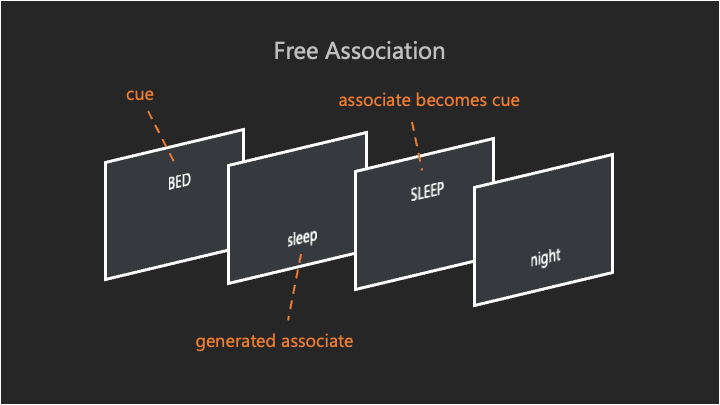

<div align="center">

# Studies

</div>

Javascript implementation of multiple online studies distributed via [psyserver](https://github.com/GabrielKP/psyserver).

## Structure

The root directory is structured as follows:

```bash
studies/
├── data
│   ├── example
│   ├── free-association
│   └── ...
├── readme
├── scripts
│   ├── get_data.sh
│   └── sync.sh
├── www
│   ├── free-association
│   └── linger-interference-pause
├── .gitignore
└── README.md
```

- `data` contains the data collected for each study. The directory names in data are the same as the ones in www
- `readme` contains files for the readme.
- `scripts` contains a synchronization script to psyserver (`sync.py`) and a data download script (`get_data.py`)
- `www` contains the code for each study.

### Internal structure

Within the study directory you find:

- `starter.html`: can start a study with appropriate parameters
- `index.html`: main wrapper page for study, will load the javascript and iniate the first screen.
- All single page html files such as `consent.html` or `complete.html`
- Folders of html files belonging to one `stage`
- `static` folder with subfolders:
  - `css`: css files, also bootstrap css file
  - `fonts`: fonts for studies
  - `js`: all js files running the study, including `main.js`, the point of entry specified in `index.html`
    - `component`: All objects that are potentially used multiple times in the study returned as an instantiable class. For instance `Pages.js`, which loads and displays a page.
    - `module`: Objects that are used throughout the study, but always refer to the one same object. The object itself is returned, and only instantiated once.
    - `stage`: An object equivalent to a "stage" of the study. Everything that happens onscreen, happens in a stage. Stages need to have a name, which is automatically logged when the stage moves on.
  - `lib`: libraries such as the bootstrap, jquery, require.js files

## Studies

### Free Association

Chained free association task (also: word chain game).

Participants are asked to type any word that comes to mind, and then based on that word type the next word that comes to mind.

<div align="center">



</div>

### linger-interference-pause

A study in which participants do free association, read a story, go through a pause, and then to free association again.

### linger-ocd

A study in which participants get a personality/rumination/depression and ocd questionnare at the end.
